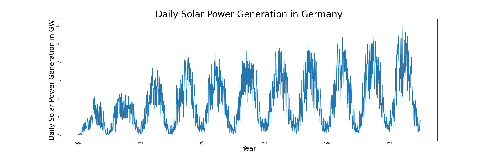
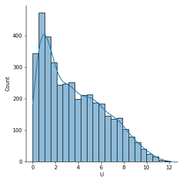
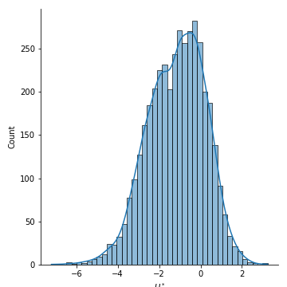
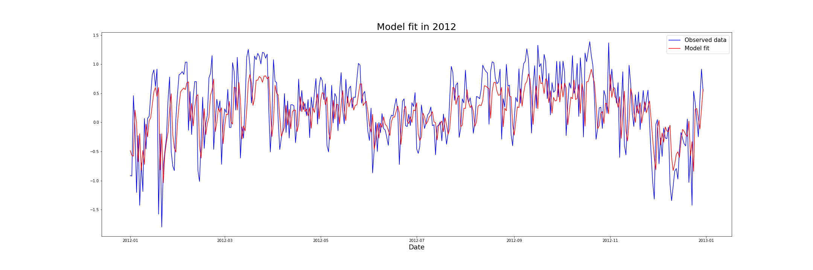

# solar-forecasting
Forecasting of German Solar Power Generetaion
This is a project for the course Statistical Tools in Finance and Insurance at Humboldt University of Berlin instructed by Prof. Dr. López Cabrera.
The data is provided by Fraunhofer Institute for Solar Energy Systems ISE.

We fit a model to the daily solar power generation in Germany.

This is the daily solar power generation in Germany in the years 2010 to 2020.

First, the we apply a logit normal transformation to normalize the data.
Distribution before transformation | Distribution after transformation
:---------------------------------:|:-------------------------:
           | 

Then, we get rid of the strong seasonality in the data by applying a linear regression with carefully chosen regressors to model the strong seasonality.
![Seasonality]seasonality.png

Lastly, we fit an ARMA model to the residuals to model the sort-term variability.

You can read the details in the project's [Jupyter notebook](stf_project.ipynb) or the [Course paper](Forecasting of Solar Power Generation.pdf)
